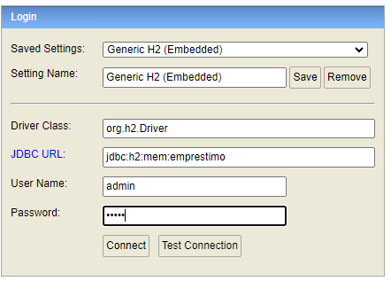
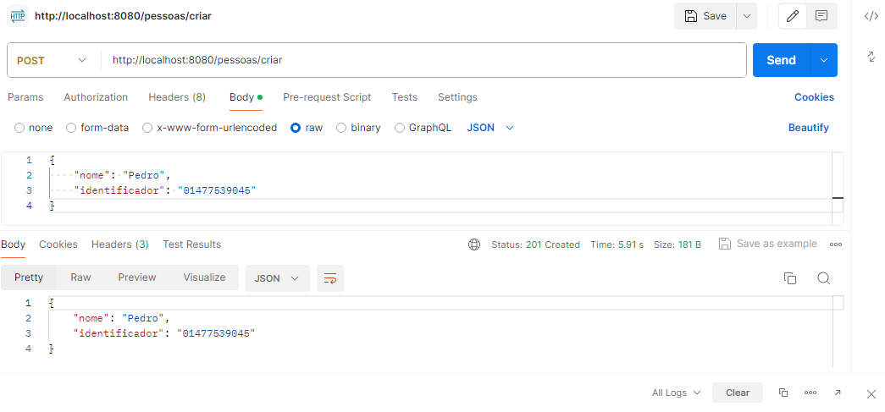
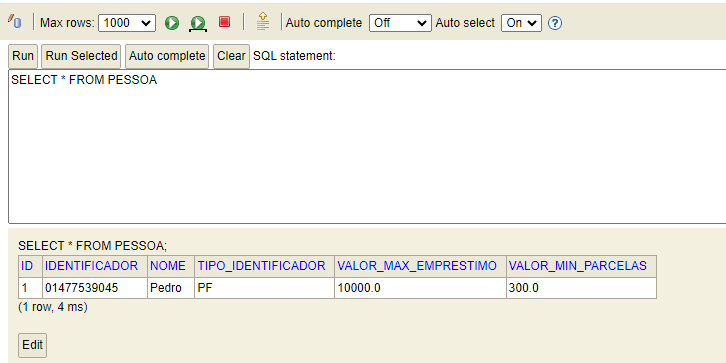
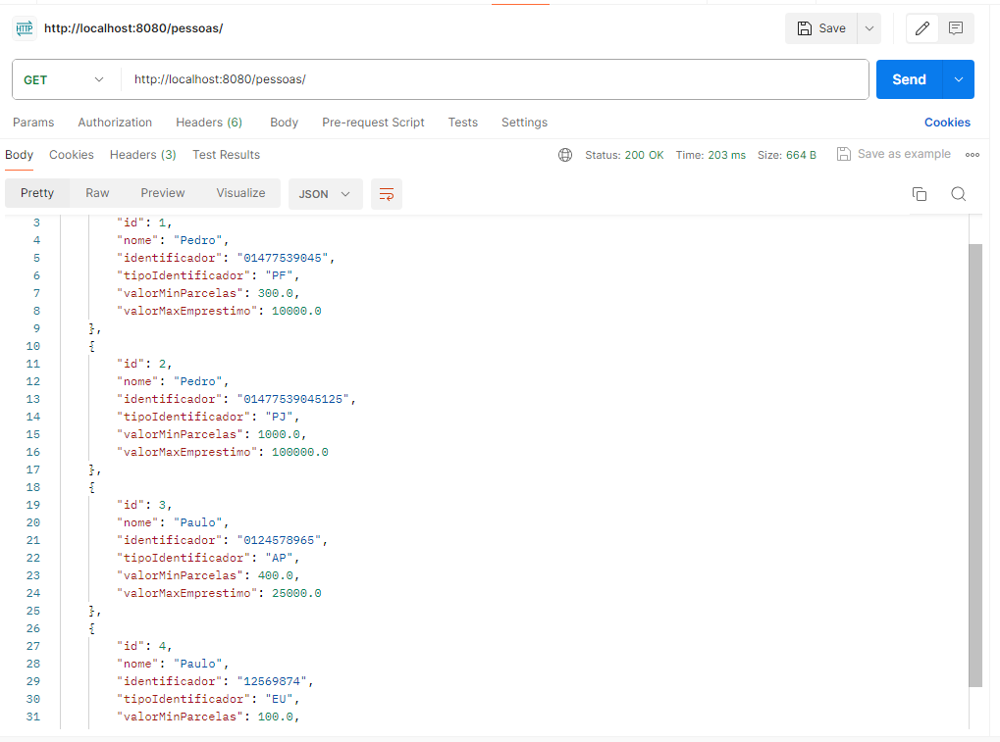
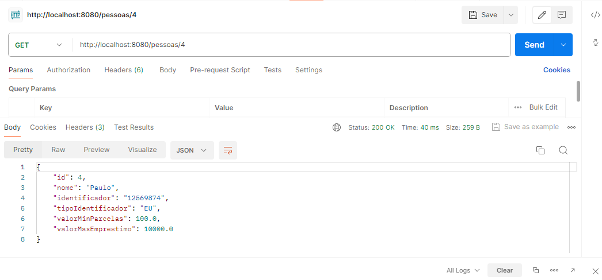
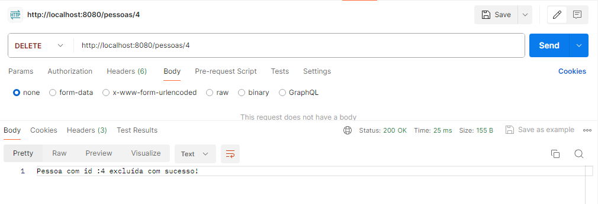
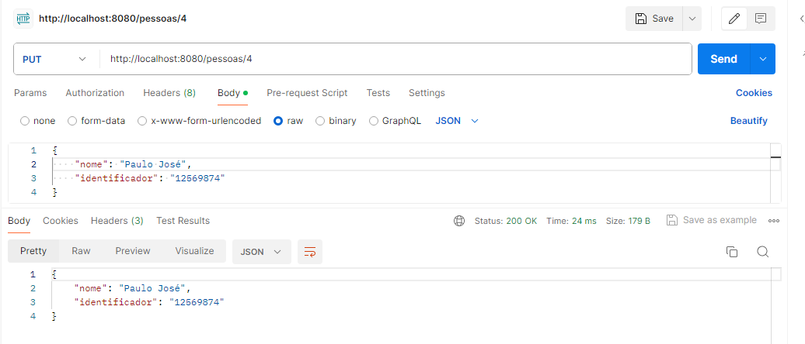
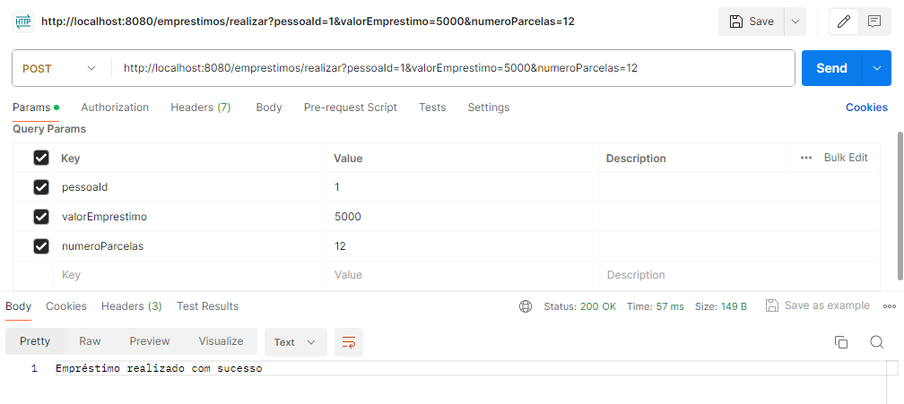
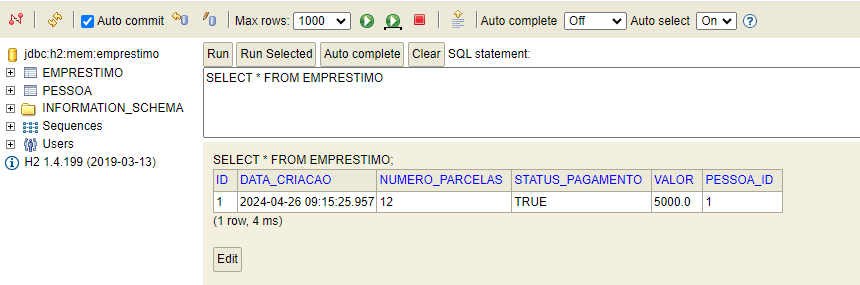

# Sistema de Empréstimos

URL Base:

	http://localhost:8080/

URL H2:

	http://localhost:8080/h2/

Console H2:

Usuário: admin

Senha: admin

## Serviço de cadastro de Pessoas

### Criar uma pessoa(POST)

	Rota: 

		http://localhost:8080/pessoas/criar		
		
	Exemplo	
		
	{
		"nome": "Pedro",
		"identificador": "01477539045"
	}

Conferindo no Banco:

### Listar todas as Pessoas(GET)

	Rota: 

		http://localhost:8080/pessoas/

### Listar uma Pessoa(GET)

	Rota: 

		http://localhost:8080/pessoas/{id}

### Excluir uma pessoa(DELETE)

	Rota: 

	http://localhost:8080/pessoas/{id}

### Atualizar uma pessoa (PUT)

	Rota: 

	http://localhost:8080/pessoas/{id}	
	
	
	Exemplo	
		
	{
		"nome": "Pedro",
		"identificador": "11"
	}	

## Serviço de Contratação de Empréstimos

### Contratar um Empréstimo (POST)

	Rota: 

	http://localhost:8080/emprestimos/realizar?pessoaId={id}&valorEmprestimo={valorEmprestimo}&numeroParcelas={numeroParcelas}	
	
	
	Exemplo	
		
	http://localhost:8080/emprestimos/realizar?pessoaId=1&valorEmprestimo=5000&numeroParcelas=12

Validando se pagamento ocorreu:

